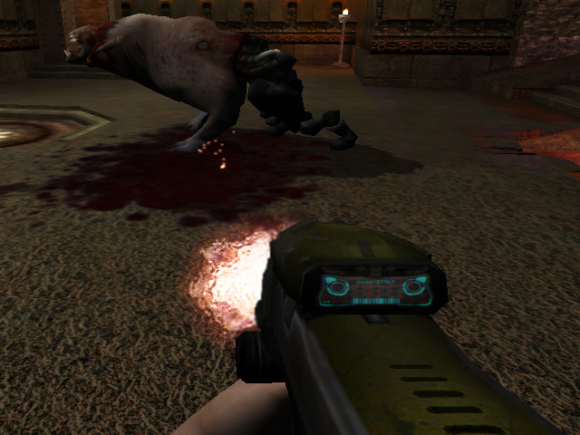



## Game Basic 3D Engine

### Description

If you're thinking about writing a game or just learning about what game programming is all about than this is for you. Game Basic has been developed with an emphasis on the importance of the 3D rendering technologies available today for the Microsoft Windows platforms.

Please visit http://www.gamebasic.com for any downloads, and a full list of online articles/tutorials.
 
### More Info
 

             |
---                |---
**Submitted On**   |
**By**             |[Monarke Studios](https://github.com/Planet-Source-Code/PSCIndex/blob/master/ByAuthor/monarke-studios.md)
**Level**          |Beginner
**User Rating**    |5.0 (15 globes from 3 users)
**Compatibility**  |VB 5\.0, VB 6\.0
**Category**       |[Games](https://github.com/Planet-Source-Code/PSCIndex/blob/master/ByCategory/games__1-38.md)
**World**          |[Visual Basic](https://github.com/Planet-Source-Code/PSCIndex/blob/master/ByWorld/visual-basic.md)
**Archive File**   |

### Source Code

Your questions and comments are greatly appreciated.

